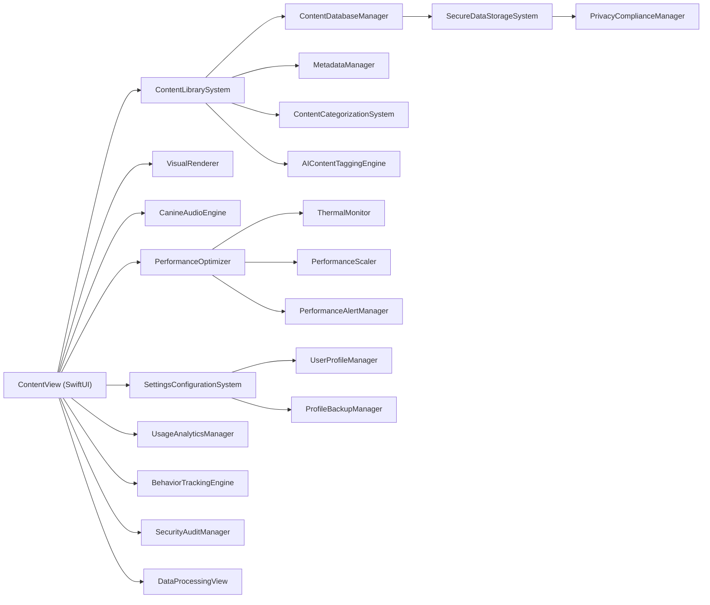

# Architecture Diagrams

Below is an overview of the primary system components and their interactions:

```mermaid
graph LR
  UI["ContentView (SwiftUI)"] --> CLS["ContentLibrarySystem"]
  CLS --> DB["ContentDatabaseManager"]
  CLS --> MM["MetadataManager"]
  CLS --> CS["ContentCategorizationSystem"]
  CLS --> AI["AIContentTaggingEngine"]
  DB --> SDS["SecureDataStorageSystem"]
  SDS --> PCM["PrivacyComplianceManager"]
  UI --> VR["VisualRenderer"]
  UI --> CAE["CanineAudioEngine"]
  UI --> PO["PerformanceOptimizer"]
  PO --> TM["ThermalMonitor"]
  PO --> PS["PerformanceScaler"]
  PO --> PAM["PerformanceAlertManager"]
  UI --> SCS["SettingsConfigurationSystem"]
  SCS --> UPM["UserProfileManager"]
  SCS --> PBM["ProfileBackupManager"]
  UI --> UAM["UsageAnalyticsManager"]
  UI --> BEH["BehaviorTrackingEngine"]
  UI --> SAM["SecurityAuditManager"]
  UI --> DPD["DataProcessingView"]
``` 