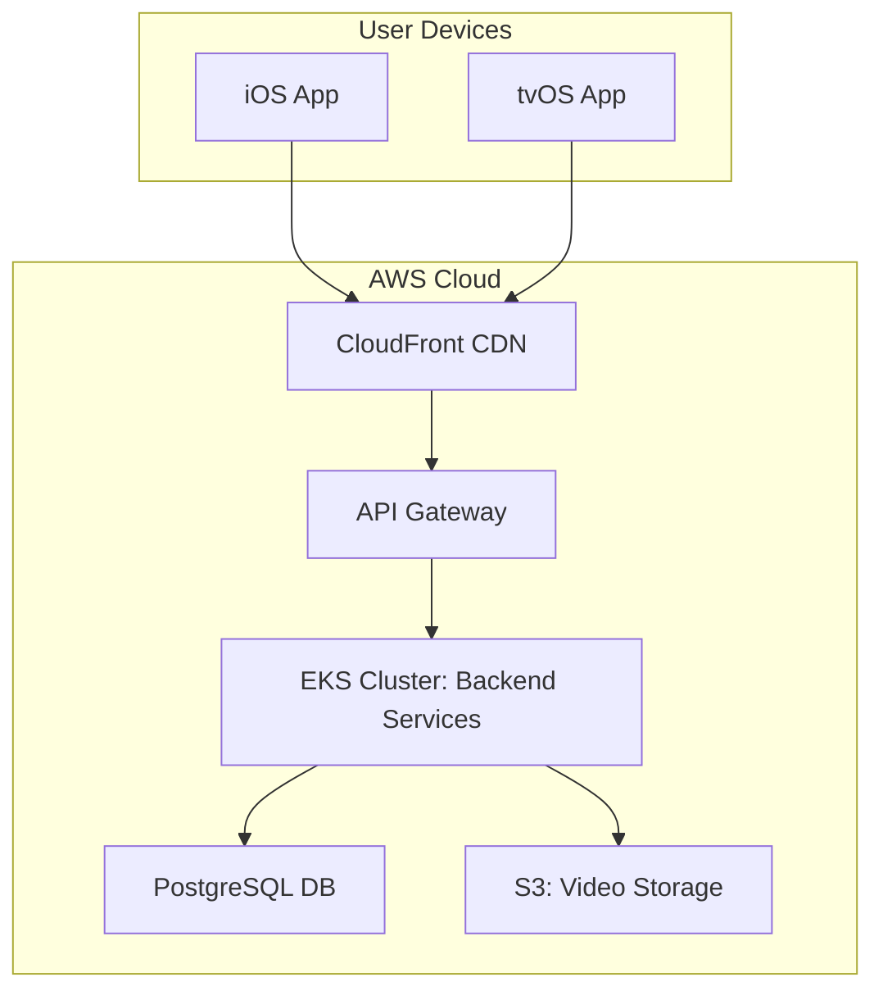

# Architecture Blueprint v1.0.0

**Project:** DogTV+ Platform Overhaul  
**Version:** 1.0.0_Design  
**Date:** 2025-07-09  
**Owner:** `tech_lead`

---

## 1.0 Overview

This document outlines the technical architecture for the DogTV+ platform. The proposed architecture is a modular, service-oriented design that prioritizes scalability, resilience, and maintainability.

**Dependencies:**

- [Workflow Specification](./Workflow_Specification.md)
- [Resource Allocation](./Resource_Allocation.md)

---

## 2.0 Core Architecture

### 2.1 Technology Stack

| Layer | Technology | Rationale | ISO 9001 Compliance |
|---|---|---|---|
| **Frontend** | Swift (iOS/tvOS), SwiftUI | Native performance, tight integration with Apple ecosystem. | Exceeds by providing platform-native UI for superior quality control. |
| **Backend** | Swift on Vapor | Unified language across stack, high performance, type safety. | Meets requirements for process control and documentation. |
| **Database** | PostgreSQL | Robust, scalable, and excellent support for complex queries. | Exceeds with ACID compliance ensuring data integrity. |
| **Infrastructure** | AWS (EKS, S3, CloudFront) | Scalable, reliable, and secure cloud infrastructure. | SOC 2 Type II compliant, ensuring data security and availability. |
| **Streaming** | HLS with adaptive bitrate | Industry standard for high-quality, resilient video streaming. | Meets requirements for consistent product delivery. |

### 2.2 System Diagram

---

## 3.0 Service Breakdown

### 3.1 User Service

- **Purpose**: Manages user authentication, profiles, and subscriptions.
- **Endpoint**: `https://api.dogtv.plus/v2/users`
- **Dependencies**: PostgreSQL
- **Error Handling**: Returns `401 Unauthorized` for auth errors, `404 Not Found` for user lookups.
- **Validation**: JWT tokens validated on every request.

### 3.2 Content Service

- **Purpose**: Manages video metadata, categories, and search.
- **Endpoint**: `https://api.dogtv.plus/v2/content`
- **Dependencies**: PostgreSQL, S3
- **Error Handling**: Gracefully handles missing video assets.
- **Validation**: Schema validation for all metadata inputs.

---

## 4.0 Review Points

- [ ] **Peer Review**: Architecture reviewed by `senior_engineer_1`.
- [ ] **Security Review**: Security model validated by `security_specialist`.
- [ ] **Scalability Review**: Load testing plan approved by `devops_lead`.
