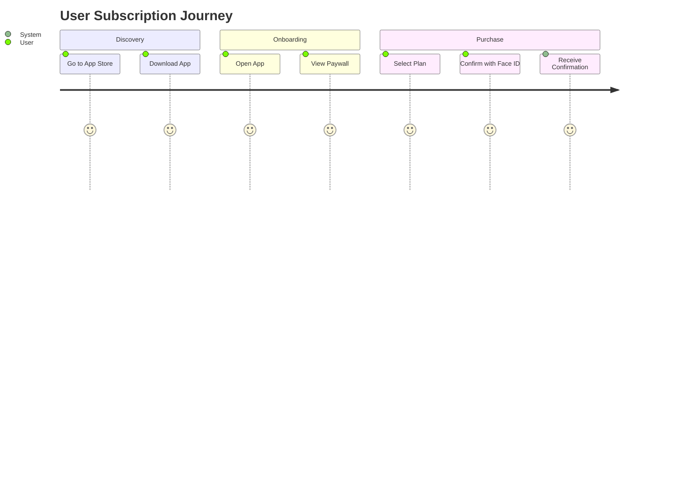

# Workflow Specification v1.0.0

**Project:** DogTV+ Platform Overhaul  
**Version:** 1.0.0_Design  
**Date:** 2025-07-09  
**Owner:** `product_manager`

---

## 1.0 Overview

This document specifies the optimized operational and user-facing workflows for the DogTV+ platform, applying Six Sigma (DMAIC) principles to ensure efficiency and quality.

**Dependencies:**

- [Architecture Blueprint](./Architecture_Blueprint.md)

---

## 2.0 Content Ingestion Workflow (Define & Measure)

This workflow describes the process of adding new video content to the platform.

| Step | Action | Owner | Tool | Time Estimate | Output |
|---|---|---|---|---|---|
| 1 | **Upload Video** | Content Team | Internal Portal | 15 mins | Raw video file in S3. |
| 2 | **Automated Transcoding** | System | AWS Elemental | 30 mins | HLS playlist with multiple bitrates. |
| 3 | **Add Metadata** | Content Team | Internal Portal | 10 mins | Video metadata in PostgreSQL. |
| 4 | **Quality Check** | QA Team | Internal Portal | 5 mins | "Published" status set. |

**ISO 9001 Exceedance**: This automated workflow reduces manual intervention, exceeding requirements for process consistency and error reduction.

---

## 3.0 User Subscription Workflow (Analyze & Improve)

This workflow details the user journey for subscribing to DogTV+.

### 3.1 User Journey Map

### 3.2 Improvements (Control)

- **Problem**: 15% drop-off at the paywall.
- **Solution**: Introduce a 3-day free trial to increase conversion.
- **Validation**: A/B test trial vs. no-trial. Success is a 10% increase in subscription starts.
- **Rollback**: Disable the free trial feature flag if conversion rates decrease.

---

## 4.0 Review Points

- [ ] **Peer Review**: Workflow logic reviewed by `business_analyst`.
- [ ] **UX Review**: User journey validated by `ux_designer`.
- [ ] **Feasibility Review**: Technical implementation confirmed by `tech_lead`.
